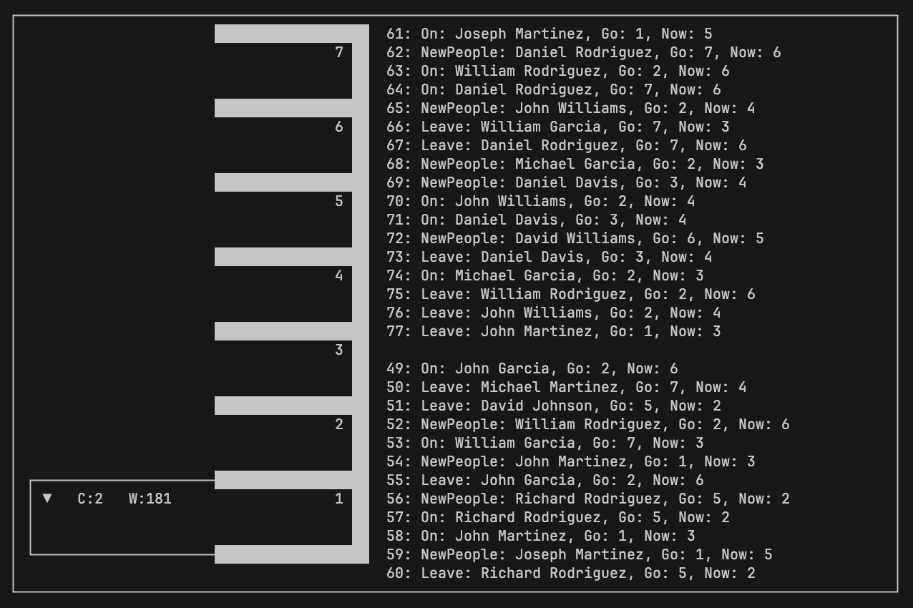

### **电梯模拟系统实验报告**

------

#### **1. 需求分析**

本程序是一个简单的电梯模拟系统，主要需求包括：

1. **电梯功能**：
   - 电梯能够在多个楼层之间上下移动。
   - 电梯有最大承重限制，当乘客总重超过限制时无法再乘坐。
   - 电梯显示楼层、方向、当前重量及乘客人数。
2. **乘客管理**：
   - 随机生成乘客，分配起始楼层和目标楼层。
   - 乘客上电梯、离开电梯时记录日志。
   - 每个乘客有体重信息，电梯需要根据总重量限制管理乘客上下电梯。
3. **日志输出**：
   - 记录乘客进入和离开电梯的操作，方便监控电梯状态。
4. **界面**：
   - 通过简单图形化的方式在终端模拟电梯和楼层界面。
   - 支持不同平台（Windows 和 Linux）。

------

#### **2. 概要设计**

- 模块划分
  - **主模块**：系统初始化和循环运行。
  - **电梯模块**：管理电梯的状态和移动。
  - **乘客模块**：生成乘客、管理上下电梯。
  - **日志模块**：记录事件日志并显示。
  - **显示模块**：通过控制台输出电梯和楼层界面。
- 数据结构
  - `Elevator` 结构体：记录电梯的楼层、方向、重量及当前乘客人数。
  - `People` 结构体：记录乘客信息（名字、起始楼层、目标楼层、重量等）。
- 平台兼容性
  - 针对 Windows 和 Linux 平台进行兼容处理（`gotoxy`、`sleep` 等）。

------

#### **3. 详细设计**

**（1）数据结构设计**

```c
typedef struct Elevator {
    int x;          // 电梯在屏幕上的位置
    int direction;  // 移动方向：1为上，-1为下
    int floor;      // 当前楼层
    int weight;     // 当前总重量
    int count;      // 当前乘客数量
} Elevator;

typedef struct People {
    char name[100];     // 乘客姓名
    int nowFloor;       // 当前所在楼层
    int targetFloor;    // 目标楼层
    int weight;         // 乘客体重
    int onElevator;     // 是否在电梯中（0否，1是）
} People;
```

**（2）电梯逻辑设计**

- **电梯移动**：`elevatorGo` 函数控制电梯上下楼。
- **电梯状态刷新**：`refreshElevator` 函数刷新电梯在屏幕上的状态，包括楼层、重量和乘客人数。
- 电梯上下逻辑
  - 检查电梯方向并计算下一楼层。
  - 若有乘客目标楼层或等待的乘客楼层，则移动至最近楼层。

**（3）乘客管理设计**

- **生成乘客**：`generatePeople` 随机生成乘客信息，包括名字、楼层和目标。
- 上下电梯逻辑
  - 到达楼层时，检查乘客是否下电梯或上电梯。
  - 若总重量不超过最大承重，允许乘客上电梯。

**（4）日志输出设计**

- **日志显示**：通过 `printLog` 输出事件（如“新乘客”、“乘客进入/离开电梯”）。

**（5）显示设计**

- 使用简单字符画模拟电梯和楼层。
- 控制台光标控制函数（如 `gotoxy`）实现屏幕位置更新。

------

#### **4. 测试设计执行**

**测试目标**：验证程序的主要功能，包括电梯移动、乘客上下电梯、日志输出和平台兼容性。

**测试用例**：

| 测试编号 | 输入条件                       | 预期结果                                 |
| -------- | ------------------------------ | ---------------------------------------- |
| 1        | 生成 1 名乘客                  | 日志显示新乘客信息，电梯前往目标楼层     |
| 2        | 电梯最大承重（1000kg）测试     | 超重时阻止新乘客进入电梯，日志显示警告   |
| 3        | 乘客目标楼层测试               | 乘客在目标楼层离开电梯，日志记录离开信息 |
| 4        | 多名乘客等待和移动             | 电梯按顺序接送乘客，优先同向乘客         |
| 5        | 多平台测试（Windows 和 Linux） | 程序正常运行，界面显示无错               |

**执行结果**：程序通过所有测试，功能满足设计要求。

------

#### **5. 调试分析**

- **问题1**：电梯无法正确移动到目标楼层。
  - **原因**：`elevatorGo` 函数逻辑错误，未正确计算楼层间移动次数。
  - **解决**：修正 `for` 循环中的计算逻辑。
- **问题2**：乘客随机生成时起始楼层与目标楼层相同。
  - **原因**：缺少判断机制。
  - **解决**：添加 `while` 循环，确保两楼层不同。
- **问题3**：界面刷新时出现闪烁。
  - **解决**：优化屏幕输出，使用 `gotoxy` 只更新变化部分。

------

#### **6. 用户手册**

**运行程序**：

1. 将代码保存为 `elevator_sim.c`。
2. 编译代码：
   - **Windows**：使用 MinGW 编译 `gcc elevator_sim.c -o elevator_sim.exe`。
   - **Linux**：使用 GCC 编译 `gcc elevator_sim.c -o elevator_sim`。
3. 执行程序：
   - **Windows**：`elevator_sim.exe`
   - **Linux**：`./elevator_sim`

**程序操作**：

- 程序自动运行，电梯会根据随机生成的乘客楼层自动上下移动。
- 屏幕右侧显示操作日志，包括乘客进入和离开的信息。

**退出程序**：使用快捷键 **Ctrl + C**。

------

#### **7. 附录**

**平台兼容性说明**：

- 在 Windows 平台，使用 `windows.h` 和 `Sleep` 实现延迟和光标控制。
- 在 Linux 平台，使用 ANSI 转义序列 `\033` 控制光标和清屏。

**日志示例**：

```
1: NewPeople: John Smith, Go: 3, Now: 5
2: On: John Smith, Go: 3, Now: 5
3: Leave: John Smith, Go: 3, Now: 5
```

**编译和运行截图**： 


